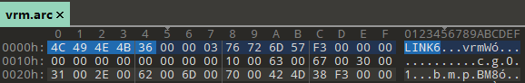

## Kaguya Tool

Tools for Kaguya engine.

### Message Tool

Export and import text from `message.dat` file.

Export text from `message.dat`

```
MsgTool -e shift_jis message.dat
```

Import text and rebuild `message.dat`

```
MsgTool -b shift_jis gbk message.dat
```

### Link6 Tool

Create a `LINK6` archive file.

```
Link6_Tool -c "e:\game\vrm.new.arc" "e:\extract\vrm" "vrm"
```

Before using this tool, please use any `HexEditor` to check original archive format.



The archive files created by this tool are not compressed and encrypted.

### ALP Tool

Convert between ALP and PNG files.

#### Convert ALP to PNG

```
ALP_Tool -e ap2 "c:\game\title.alp"
```

The tool will creates `c:\game\title.png` and `c:\game\title.metadata.json`.

Do not delete the `.metadata.json`, it is used to create `ALP` from `PNG`.

#### Convert PNG to ALP

Make sure `c:\game\title.png` and `c:\game\title.metadata.json` exists.

```
ALP_Tool -c ap2 "c:\game\title.png"
```

### Environment

[.NET Desktop Runtime 5.0](https://dotnet.microsoft.com/download/dotnet/5.0)

### Tested

+ Mama x Holic ~Miwaku no Mama to Ama Ama Kankei\~
